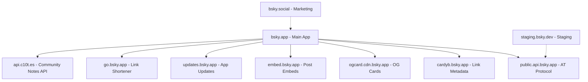

 Domain Architecture & Bluenotes Strategy

## Overview

This document analyzes the Bluesky domain architecture and outlines the strategy for deploying a fork called "Bluenotes" while maximizing infrastructure reuse and minimizing deployment complexity.

## Bluesky Domain Architecture Analysis

### Current Bluesky Domains & Their Purposes

| **Domain** | **Purpose** | **Service Type** | **Examples** |
|------------|-------------|------------------|--------------|
| `bsky.social` | Marketing/info website | Static site | Blog, support docs, privacy policy |
| `bsky.app` | Main web application | React Native Web | Primary user interface |
| `go.bsky.app` | Link shortener/referral tracking | Redirect service | External link tracking |
| `staging.bsky.dev` | Staging environment | Development | Testing builds |
| `public.api.bsky.app` | AT Protocol AppView API | API service | Main AT Protocol endpoint |
| `api.bsky.app` | Alternative API endpoint | API service | Feed generation, etc. |
| `embed.bsky.app` | Post embedding service | Embed service | Social media post embeds |
| `ogcard.cdn.bsky.app` | OG card image generation | CDN service | Social sharing images |
| `cardyb.bsky.app` | Link metadata proxy | Proxy service | Link preview generation |
| `updates.bsky.app` | App update manifest | Update service | Mobile app updates |
| `status.bsky.app` | Status page | Monitoring | Service status |
| `gifs.bsky.app` | GIF service | Media service | GIF hosting/processing |
| `video.bsky.app` | Video service | Media service | Video hosting/processing |

### Service Dependencies



## Bluenotes Deployment Strategy

### Domain Mapping Strategy

| **Bluesky Domain** | **Purpose** | **Bluenotes Equivalent** | **Strategy** | **Rationale** |
|-------------------|-------------|--------------------------|--------------|---------------|
| `bsky.app` | Main web app | `bluenotes.social` | **Replace** | Our primary deployment target |
| `bsky.social` | Info/marketing site | *None needed* | **Skip** | Not essential for MVP |
| `go.bsky.app` | Link shortener | *None needed initially* | **Optional** | Can implement later if needed |
| `staging.bsky.dev` | Staging | *None needed* | **Skip** | Direct production deployment |
| `public.api.bsky.app` | AT Protocol API | **Keep using Bluesky's** | **Reuse** | Leverage existing infrastructure |
| `embed.bsky.app` | Post embeds | **Keep using Bluesky's** | **Reuse** | Cross-domain compatible |
| `ogcard.cdn.bsky.app` | OG cards | **Keep using Bluesky's** | **Reuse** | Images don't trigger CORS |
| `cardyb.bsky.app` | Link metadata | **Keep using Bluesky's** | **Reuse** | Has `access-control-allow-origin: *` |
| `updates.bsky.app` | App updates | **Keep using Bluesky's** | **Reuse** | Mobile app compatibility |

### Infrastructure Reuse Benefits

#### ✅ **Services We Can Reuse**
1. **AT Protocol Infrastructure** (`public.api.bsky.app`)
   - Full AT Protocol compatibility
   - No additional infrastructure needed
   - Access to existing user base and data

2. **Link Metadata Proxy** (`cardyb.bsky.app`)
   - CORS enabled (`access-control-allow-origin: *`)
   - Handles link previews in composer
   - No cross-domain issues

3. **OGCard Service** (`ogcard.cdn.bsky.app`)
   - Used via `` tags (no CORS needed)
   - Server-side rendering for social media cards
   - Starter pack image generation

4. **Post Embed Service** (`embed.bsky.app`)
   - Social media post embedding
   - Cross-platform compatibility
   - No additional development needed


#### ⚠️ **Services We Need to Replace**
1. **Main Web Application** (`bsky.app` → `bluenotes.social`)
   - Deploy our own React Native Web build
   - Single Fly.io instance deployment
   - Custom branding and Community Notes features

### Technical Implementation

#### Required Code Changes for Bluenotes Deployment

1. **App Configuration** (`app.config.js`)
   ```javascript
   // Change these values
   name: 'Bluesky' → 'Bluenotes'
   slug: 'bluesky' → 'bluenotes'
   scheme: 'bluesky' → 'bluenotes'
   bundleIdentifier: 'xyz.blueskyweb.app' → 'social.bluenotes.app'
   
   // Update intent filters
   host: 'bsky.app' → 'bluenotes.social'
   
   // Add associated domains
   'applinks:bluenotes.social'
   'appclips:bluenotes.social'
   ```

2. **Package Configuration** (`package.json`)
   ```json
   "name": "bsky.app" → "bluenotes.social"
   ```

3. **Navigation & Deep Linking** (`src/Navigation.tsx`)
   ```javascript
   // Add Bluenotes prefixes
   prefixes: ['bluenotes://', 'https://bluenotes.social', ...]
   
   // Update referrer tracking
   hostname !== 'bluenotes.social'
   ```

4. **Share URLs** (Topic/Hashtag screens)
   ```javascript
   // Update share URLs
   new URL('https://bsky.app') → new URL('https://bluenotes.social')
   ```

5. **Web Configuration** (`web/index.html`)
   ```html
   <!-- Add preconnect for performance -->
   <link rel="preconnect" href="https://bluenotes.social">
   ```

#### Services to Keep As-Is

1. **AT Protocol Endpoints**
   ```javascript
   // Keep these unchanged
   ATP_APPVIEW_HOST=https://public.api.bsky.app
   PUBLIC_BSKY_SERVICE=https://public.api.bsky.app
   ```

2. **External Service References**
   ```javascript
   // Keep using Bluesky's services
   OGCARD_HOST=https://ogcard.cdn.bsky.app
   EMBED_SERVICE=https://embed.bsky.app
   PROD_LINK_META_PROXY=https://cardyb.bsky.app/v1/extract?url=
   ```

3. **Test Data & Localization**
   - Leave all test references to `bsky.app` unchanged
   - Keep localization files as-is
   - Maintain compatibility references

### Deployment Architecture

#### Single Service Deployment
```
┌─────────────────────────────────────────────────────────────┐
│                    Fly.io Instance                          │
│                  (bluenotes.social)                         │
├─────────────────────────────────────────────────────────────┤
│  ┌─────────────────┐  ┌─────────────────────────────────┐   │
│  │   React Native  │  │        Go Web Server            │   │
│  │   Web Build     │  │       (bskyweb)                 │   │
│  │                 │  │  - Serves static files          │   │
│  │  - Bluenotes UI │  │  - Server-side rendering        │   │
│  │  - Community    │  │  - Handles routing              │   │
│  │    Notes        │  │                                 │   │
│  └─────────────────┘  └─────────────────────────────────┘   │
└─────────────────────────────────────────────────────────────┘
                              │
                              ▼
┌─────────────────────────────────────────────────────────────┐
│              External Services (Reused)                    │
├─────────────────────────────────────────────────────────────┤
│  • public.api.bsky.app     - AT Protocol API               │
│  • cardyb.bsky.app         - Link metadata                 │
│  • ogcard.cdn.bsky.app     - OG card images                │
│  • embed.bsky.app          - Post embeds                   │
│  • updates.bsky.app        - App updates                   │
│  • api.c10t.es             - Community Notes               │
└─────────────────────────────────────────────────────────────┘
```

#### Environment Variables Strategy
```bash
# Bluenotes-specific
DOMAIN=bluenotes.social
APP_NAME=bluenotes-web
CORS_ALLOWED_ORIGINS=https://bluenotes.social,https://www.bluenotes.social

# Reused Bluesky services
ATP_APPVIEW_HOST=https://public.api.bsky.app
OGCARD_HOST=https://ogcard.cdn.bsky.app

# Build configuration
EXPO_PUBLIC_ENV=production
EXPO_PUBLIC_BUNDLE_IDENTIFIER=bluenotes-production
```

### Community Notes Service Architecture

#### Service URL Determination
The Community Notes service uses intelligent environment switching:

```typescript
export function COMMUNITY_NOTES_SERVICE(serviceUrl: string) {
  if (IS_PROD_SERVICE(serviceUrl)) {
    return 'https://api.c10t.es'  // Production
  }
  if (serviceUrl === STAGING_SERVICE) {
    return 'https://api.c10t.es'  // Staging (same as prod)
  }
  return 'http://localhost:2595'      // Local development
}
```

#### Environment Switching Behavior
- **Production AT Protocol** (`public.api.bsky.app`) → **Production Community Notes** (`api.c10t.es`)
- **Staging AT Protocol** (`staging.bsky.dev`) → **Production Community Notes** (`api.c10t.es`)  
- **Localhost AT Protocol** (`localhost:2584`) → **Localhost Community Notes** (`localhost:2595`)

#### Integration Benefits
1. **Automatic Environment Switching**: Follows AT Protocol service selection
2. **Development Support**: Localhost service for testing
3. **Cross-Domain Compatible**: No CORS restrictions observed
4. **Existing Infrastructure**: No additional deployment needed

### Cross-Domain Compatibility Analysis

#### ✅ **Confirmed Compatible Services**
1. **Link Metadata Proxy** (`cardyb.bsky.app`)
   - **CORS Headers**: `access-control-allow-origin: *`
   - **Test Result**: ✅ Works from any domain
   - **Usage**: Link previews in composer

2. **OGCard Service** (`ogcard.cdn.bsky.app`)
   - **Method**: Used via `` tags
   - **CORS**: Not applicable for image requests
   - **Usage**: Starter pack images, social sharing

3. **AT Protocol APIs** (`public.api.bsky.app`)
   - **Method**: Direct API calls from client
   - **Authentication**: User-based, not domain-based
   - **Usage**: All social features, data access

4. **Community Notes Service** (`api.c10t.es`)
   - **Method**: Direct API calls via XRPC protocol
   - **Environment Switching**: Automatic based on AT Protocol service
   - **Usage**: Notes creation, rating, labeling, configuration

#### ⚠️ **Potential Limitations**
1. **Rate Limiting**: Services may have rate limits per domain
2. **Analytics**: Bluesky won't get analytics from Bluenotes usage
3. **Future Changes**: Bluesky could restrict cross-domain access

### Migration Strategy

#### Phase 1: Minimal Viable Product
1. Deploy single Fly.io instance with rebranding
2. Use all existing Bluesky services
3. Focus on Community Notes functionality
4. Monitor service compatibility

#### Phase 2: Service Independence (Future)
1. Deploy own OGCard service if needed
2. Implement own link shortener
3. Add custom analytics
4. Consider own AT Protocol infrastructure

### Risk Assessment

| **Risk** | **Probability** | **Impact** | **Mitigation** |
|----------|----------------|------------|----------------|
| Bluesky blocks cross-domain requests | Low | High | Deploy own services |
| Rate limiting issues | Medium | Medium | Monitor usage, implement caching |
| Service deprecation | Low | Medium | Have fallback implementations ready |
| Performance issues | Low | Low | Use CDN, optimize requests |

### Benefits of This Strategy

1. **Rapid Deployment**: Minimal infrastructure setup required
2. **Cost Efficiency**: Single Fly.io instance vs. multiple services
3. **Compatibility**: Full AT Protocol ecosystem access
4. **Maintenance**: Focus on app features, not infrastructure
5. **Scalability**: Can migrate services independently as needed

### Future Considerations

1. **Service Monitoring**: Track usage of external services
2. **Fallback Planning**: Prepare alternatives for critical services
3. **Performance Optimization**: Consider CDN for static assets
4. **Analytics**: Implement own tracking for user behavior
5. **Compliance**: Ensure usage aligns with Bluesky's terms

## Conclusion

This domain strategy enables rapid deployment of Bluenotes while leveraging existing Bluesky infrastructure. The approach minimizes complexity and cost while maintaining full functionality and AT Protocol compatibility.

The strategy can evolve over time, with services migrated to independent infrastructure as needed based on usage patterns, performance requirements, and service availability.
